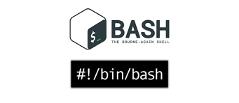

  

# Bash Scripts

> Bash scripts for automate daily development tasks

 

## Table of Contents
1.- [Basic Development Tasks](https://github.com/IberaSoft/bash-scripts/1-basic-development-tasks/README.md)
2.- [Advanced Development Tasks](https://github.com/IberaSoft/bash-scripts/2-advanced-development-tasks/README.md)
3.- [Additional resources](#additional-resources)
4.- [Contribute](#contribute)
4.- [License](#license)

## Additional resources
- You can view a command's documentation right in bash with `man <command name>`.
- [Official bash manual](https://www.gnu.org/software/bash/manual/bash.html)
- [TLDP bash programming intro, basic](http://tldp.org/HOWTO/Bash-Prog-Intro-HOWTO.html)
- [TLDP bash programming intro, advanced](http://www.tldp.org/LDP/abs/html/)

## Contribute

Contributions are welcome!. Please read [this](CONTRIBUTING.md) document first.

## License

- [MIT license](http://opensource.org/licenses/mit-license.php)
- Copyright 2017 © <a href="http://iberasoft.com" target="_blank">IberaSoft</a>.
